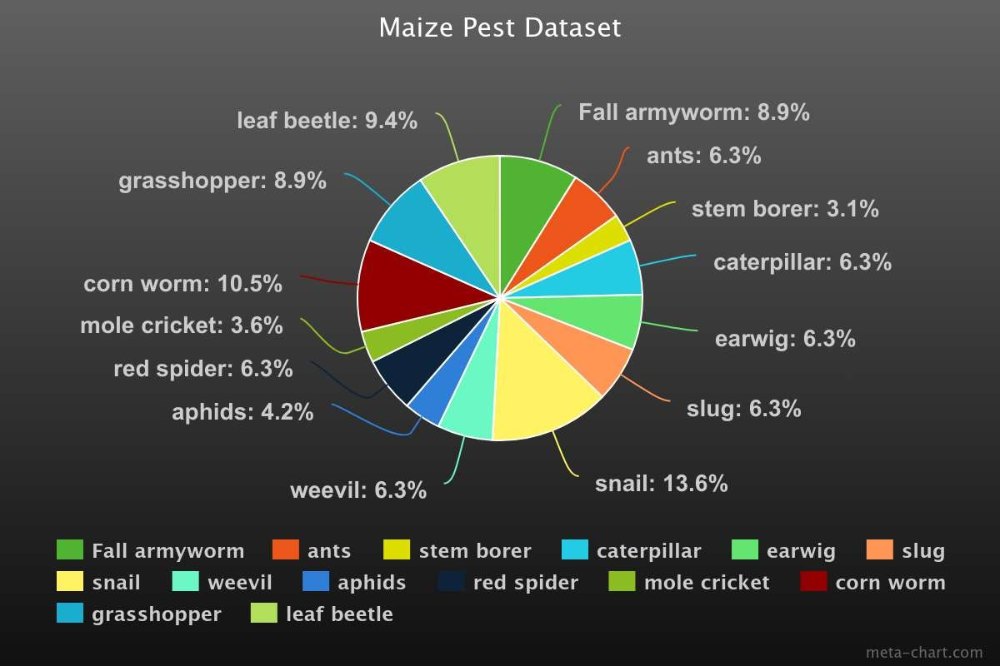
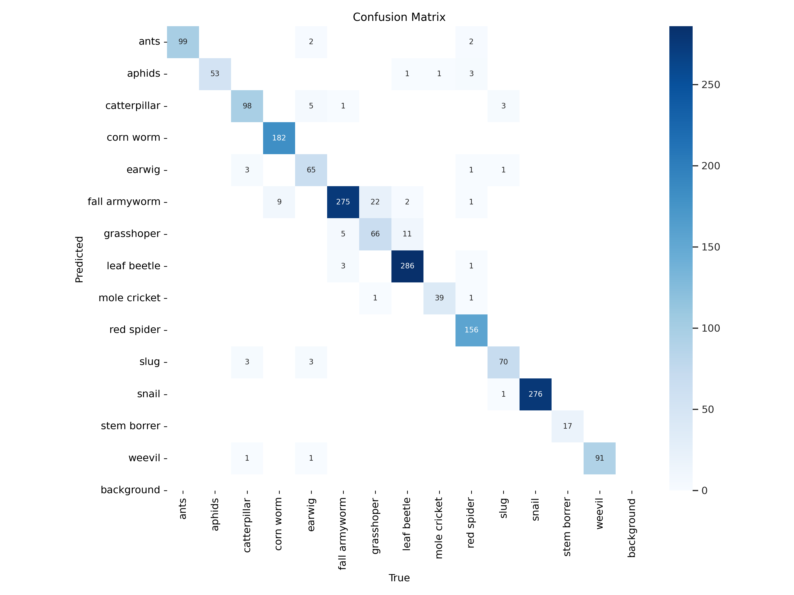
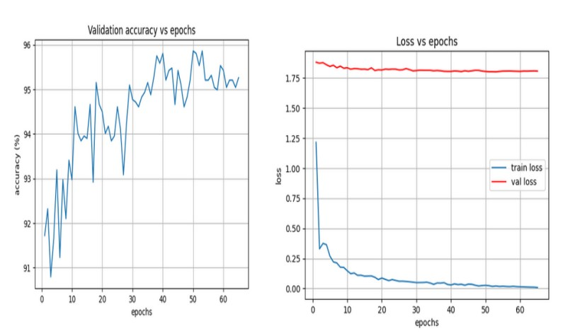
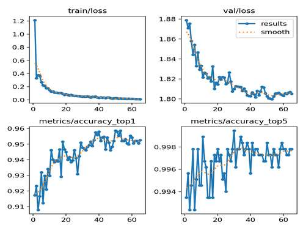

# Maize Pest Detection and Identification using YOLOv8

## Introduction

The Maize Pest Detection and Identification system leverages YOLOv8, a cutting-edge object detection model, to accurately identify and classify various pests affecting maize plants. YOLOv8 excels in real-time object detection by providing high accuracy and speed, thanks to its advanced architecture. 

**YOLOv8**: YOLOv8 (You Only Look Once version 8) is a powerful object detection model that performs end-to-end detection of objects in images. It achieves high performance by simultaneously predicting bounding boxes and class probabilities in a single forward pass through the network. The model gives accuracy of 85%.

**Architecture Image**: ![YOLOv8_self.png)

**Comparison with Other Models**: ![Comparison.png)

## Dataset

The dataset used for training the model includes 8,359 images of maize pests, categorized into 14 distinct classes:

- Fall armyworm
- Snail
- Weevil
- Grasshopper
- Ants
- Aphids
- Leaf beetle
- Stem borer
- Caterpillar
- Earwig
- Slug
- Red spider
- Corn worm

Each class represents different pests and stages of maize plant growth, enabling the system to detect pests with high precision.

## Project Files

- **Jupyter Notebook**: `maize_pests.ipynb` - Contains the complete training process and methodology for the YOLOv8 model.
- **Weights**: `weights/` - Contains the trained models. Since the Size of trained model is too large so the google drive link is given.
visit the [Google Drive](https://drive.google.com/drive/folders/1-2SifQO3BlOeNZZ1YPTHMX6EId2KJch5?usp=drive_link).
- **Results and Analysis**: Includes accuracy metrics, result images, confusion matrix, and plots of validation accuracy vs. epochs and loss vs. epochs.
   **Result Image**: 
   **Confusion Matrix**: 
   **Validation Accuracy vs Epochs**: 
   **Loss vs Epochs**: 

## Advantages and Applications

- **Efficient Pest Management**: Helps in early detection and accurate identification of pests, enabling targeted pest control measures.
- **Real-Time Monitoring**: Suitable for real-time monitoring of maize crops, reducing the need for manual inspections and improving productivity.
- **Data-Driven Insights**: Provides valuable data for analyzing pest patterns and improving crop management strategies.

## Author

Arun Kumar Sah

## Copyright

© 2024 Arun Kumar Sah. All rights reserved.

## GitHub Repository

For the complete source code and additional information, visit the [GitHub Repository](https://github.com/arunsah10/Maize-Pest-Detection-And-Identification).
